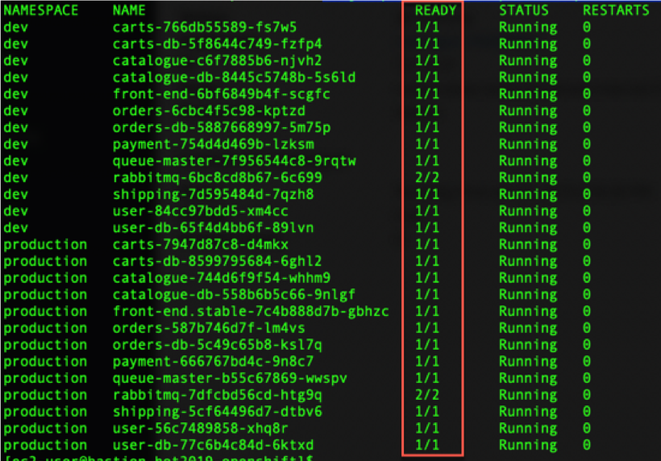
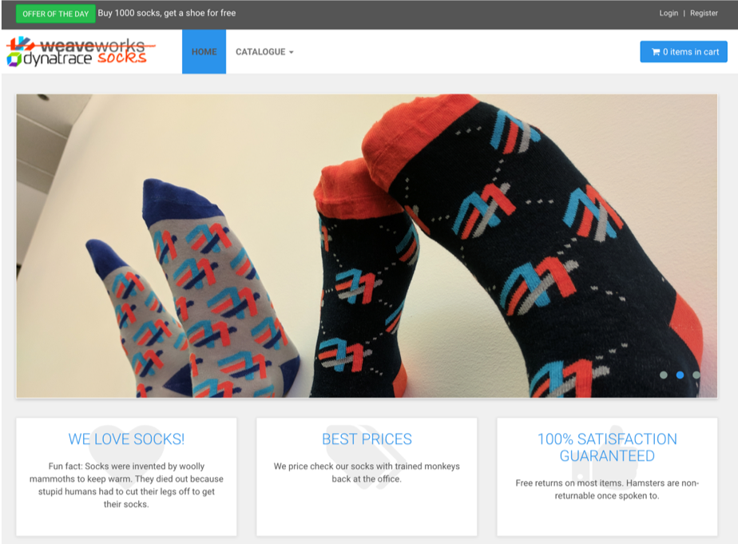

# Exercise #1 Deploy the Sock Shop app

## Script overview

First download the workmaterial from the github repo:
```sh
$ git clone https://github.com/se-bootcamp-2019/dynatrace-k8s 
```
Change directory to `dynatrace-k8s`. You can take a look at the deployment script:
```sh
$ less deploy-sockshop.sh
```
The script does the following tasks:
- Create a dev namespace
- Create a production namespace
- Deploy the backend services (databases and message queuing)
- Deploy the application services
- Expose frontend and carts services to public internet

## Deploy Sock Shop
Execute the deployment script:
```sh
$ ./deploy-sockshop.sh
```
## Validate
Check the pods deployed in production and in dev
```sh
$ kubectl get po --all-namespaces -l product=sockshop
```
Notice some pods status and ready state. Watch pods (run the previous command with flag -w) until all are running and ready.



## Access the Sock Shop web app

The application deployment created a Service resource of type Load Balancer to expose the frontend service to the public internet.
You can obtain the app URL by running these commands, respectively for the production and the dev environments:

```console
$ kubectl get svc front-end -n production
$ kubectl get svc front-end -n dev
```


Notice the port (8080)

## Explore the app

Load the Sock Shop app page to your browser.
Run some transactions (Register, Logout, Login, Catalogue, Add to Cart, etc) .




---

:arrow_forward: [Next Exercise : #2 Deploy the OneAgent Operator](../02_Deploy_OneAgent_Operator)

:arrow_up_small: [Back to overview](../)