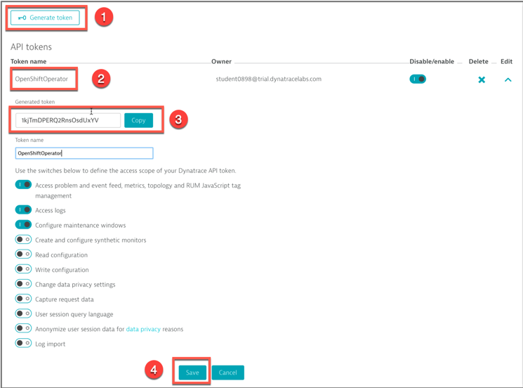

# Exercise #2 Deploy the OneAgent Operator

## Gather environment and token info
### Environment ID

To configure and deploy the OneAgent Operator, we will need the following info from your SaaS tenant

- Environment ID
- Installation API token
- PaaS token

The installation procedure is also documented [here](https://www.dynatrace.com/support/help/shortlink/kubernetes-deploy) 

For Dynatrace SaaS, the environment ID is your tenant ID. You can find it in the first part of your URL, e.g. `https://ENVIRONMENTID.sprint.dynatracelabs.com` . Copy it to your cheat sheet.

- For example, for https://jwx05250.sprint.dynatracelabs.com , ENVIRONMENT ID=jwx05250

### API Token

Go in Settings -> Integration -> Dynatrace API

1. Click on Generate Token
2. Enter a name for your token (e.g. k8sOperator)
3. Copy the token value and paste it in your cheat sheet (API_TOKEN)
4. Don't forget to click on the Save button

 

### PaaS Token

Go in Settings -> Integration -> Platform as a Service
1. Either copy the existing InstallerDownload token or click on Generate Token
2. Enter a name for your token (e.g. k8sOperatorPaaS), click Save
3. Copy the token value and paste it in your cheat sheet (PAAS_TOKEN)


## Deploy the Operator

Execute the following commands to create the objects necessary for the Operator:

```sh
$ kubectl create namespace dynatrace
$ LATEST_RELEASE=$(curl -s https://api.github.com/repos/dynatrace/dynatrace-oneagent-operator/releases/latest | grep tag_name | cut -d '"' -f 4)
$ kubectl create -f https://raw.githubusercontent.com/Dynatrace/dynatrace-oneagent-operator/$LATEST_RELEASE/deploy/kubernetes.yaml
```

Check the logs at any time with the following command (ctrl-C to stop):
```sh
$ kubectl -n dynatrace logs -f deployment/dynatrace-oneagent-operator
```

Create the secret (named oneagent) holding the API and PaaS tokens used to authenticate to the Dynatrace cluster. Replace `<API_TOKEN>` and `<PAAS_TOKEN>` with the values copied in your cheat sheet

```sh
$ kubectl -n dynatrace create secret generic oneagent --from-literal="apiToken=API_TOKEN" --from-literal="paasToken=PAAS_TOKEN"
```

Execute the following script, it will download the Operator Custom Resource definition and populate it with the provided Environment ID. 

```sh
$ ./config_cr.sh
```

You can validate the cr.yaml file (cat cr.yaml) then create the custom resource:

```sh
$ kubectl create -f cr.yaml
```

## Validate the installation

Execute the following commands to validate the expected pods are running. You should see one pod for the operator and one pod for each of your cluster nodes (3)

```sh
$ kubectl get pods -n dynatrace -o wide -w
```

In the Dynatrace console, look into the Deployment Status and Hosts dashboards, you should see your nodes listed.

Explore the host dashboard.
- Drill down to the containers
- Drill down to the processes

Explore the Technologies dashboard


```sh
$ git clone https://github.com/se-bootcamp-2019/dynatrace-k8s 
```
Change directory to `dynatrace-k8s`. You can take a look at the deployment script:
```sh
$ less deploy-sockshop.sh
```
The script does the following tasks:
- Create a dev namespace
- Create a production namespace
- Deploy the backend services (databases and message queuing)
- Deploy the application services
- Expose frontend and carts services to public internet

## Recycle the pods for instrumentation

The currently running pods need to be recycled so the processes running in the containers can be instrumented. The instrumentation takes place on process start up.

Execute the following script :

```sh
$ ./recycle-sockshop-app-pods-to-instrument.sh
```

Execute this command to check pod status until all are ready (ctrl-c to stop): 

```sh
$ kubectl get po --all-namespaces -l product=sockshop –w
```

