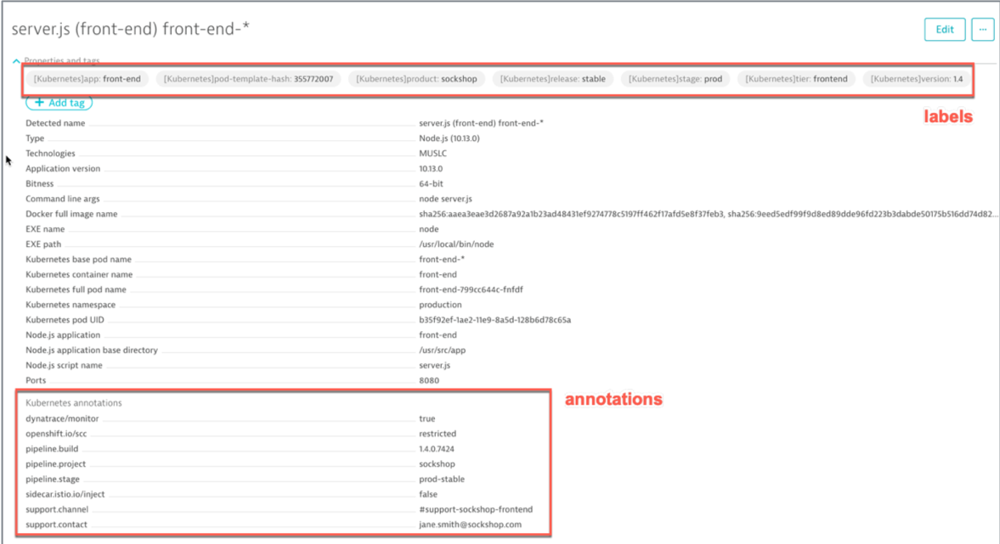

# Exercise #3 Automatic import of Kubernetes labels and annotations

## Explore metadata in pod definitions

<mark>`PLACEHOLDER - this section needs to be reworked for EKS, ideally using k8s dashboard?`</mark>

Pick up a pod and a namespace (`production` or `dev`) and get the pods details, including the Labels and the Annotations

```sh
$ kubectl describe po <pod_name> -n <namespace>
```


## Grant viewer role to service accounts

The OneAgent will use a pod service account to query for its metadata via the Kubernetes API.

The service accounts must be granted viewer role in order to have access

In the terminal, execute the following command to grant viewer role

```sh
$ kubectl create rolebinding serviceaccounts-view --clusterrole=view --group=system:serviceaccounts:production --namespace=production
```

You can repeat the procedure for the `dev` namespace.

```sh
$ kubectl create rolebinding serviceaccounts-view --clusterrole=view --group=system:serviceaccounts:dev --namespace=dev
```

### Wait...

Wait a few minutes :grinning: seriously, let's take a 10 minutes break here


In the Dynatrace console: 

- Navigate to one of the process group, for example the front-end (Technologies -> Node.js -> server.js -> Process group details)
- Expand the properties. 
- The imported Kubernetes labels will show as tags and the annotations as properties.



## Search/filter with tags based on labels

- Go in the Technologies or the Services and Transactions view. 

- In the Filtered by text box, you will see the available tags that you can select.


You can also perform searches for label values in the Super Search box!

You will see that not only processes are showing up but services too. This is because the labels are automatically propagated from the process (container) entity to the services implemented by the process!

- Select and drill-down the service to see the labels attached as tags.


---

[Previous Step: Exercise #2 Deploy the OneAgent Operator](../02_Deploy_OneAgent_Operator) :arrow_backward: :arrow_forward: [Next Step: Deploy Jenkins](../3_Deploy_Jenkins)

:arrow_up_small: [Back to overview](../)