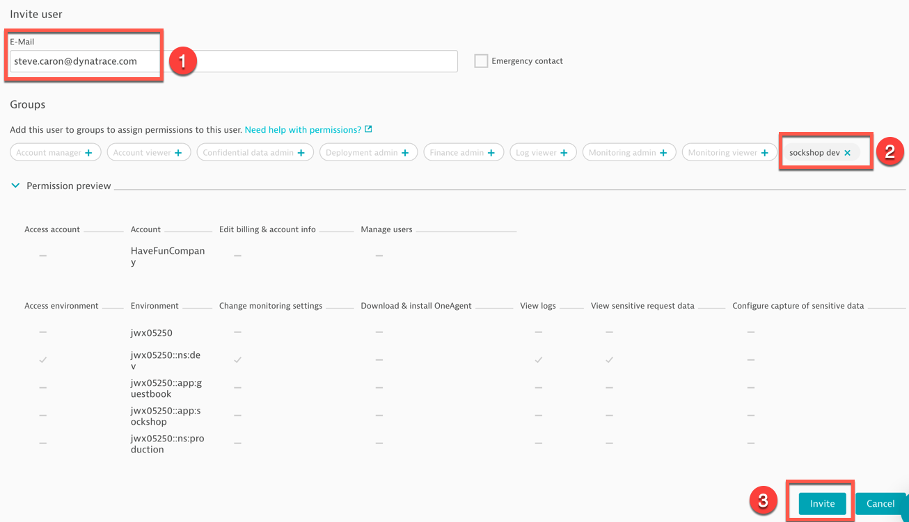

# Exercise #8 Role-Based Access Control with Management Zones

## Create new User Groups

- Go in <b>User</b> (User icon, top right) <b>-> Account Settings -> Group Management</b>
- Click on <b>Create new group</b> and configure the group to only access Sock Shop dev environment (management zone). 

## Invite new user

- Go in <b>User Management</b> and click <b>Invite user</b>
- Enter an email address <b>(1)</b> for the new user (use a real email address – you will need to retrieve the invite email)
- Add the user to the sock shop dev group only <b(2)</b>
- Expand the <b>Permission preview</b> to validate the user only access  the <b>ns:dev</b> management zone
- Click on <b>Invite</b>

## Retrieve invitation and sign up

- Retrieve the invitation email
- Either logout of your current session or user a different browser to confirm the invitation and sign up and log in with the new user account  

## Validate data access in Dynatrace

- Once logged in as the new user, navigate around. 
- You will see your new user only have access to Sock Shop data related to the Kubernetes <b>dev</b> namespace.

---

[Previous : #7 Create Management Zones by application](../07_Management_Zones_by_namespace) :arrow_backward: :arrow_forward: [Next : #9 Set up alert notifications](../09_Set_up_alert_notifications)

:arrow_up_small: [Back to overview](../)