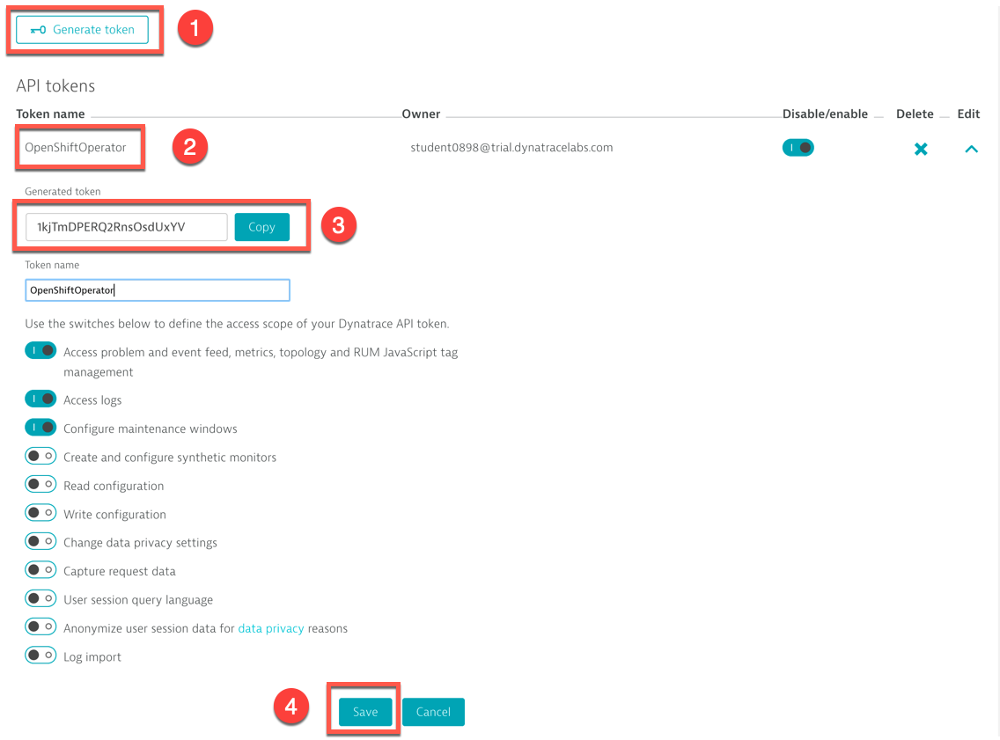
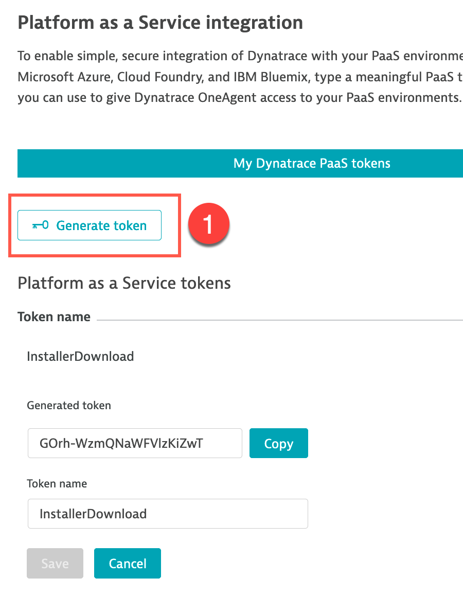
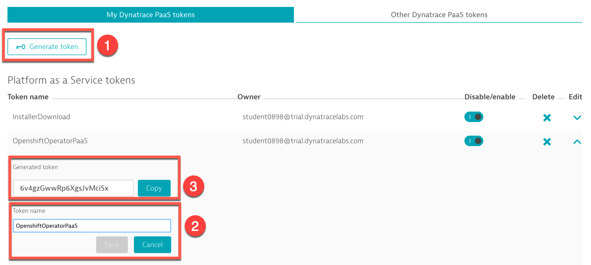

# Exercise #2 Deploy the OneAgent Operator

## Gather environment and token info

To configure and deploy the OneAgent Operator, we will need the following info from your SaaS tenant:

- Environment ID
- API token
- PaaS token

Note: The installation procedure is also documented [here](https://www.dynatrace.com/support/help/shortlink/kubernetes-deploy) 

From your bastion host terminal, execute the following script to enter this info to have it stored in the `configs.txt` file and environment variables so you don't need to type or copy-paste it again during the class.

```
$ source get-dt-cfg.sh
```
Again, you can always, if needed, get those configs printed by running this command (from the current directory):

```sh
$ cat configs.txt
```

### Environment ID

For Dynatrace SaaS, the environment ID is your tenant ID. You can find it in the first part of your URL, e.g. `https://ENVIRONMENTID.sprint.dynatracelabs.com` .

- For example, for https://jwx05250.sprint.dynatracelabs.com , ENVIRONMENT ID=jwx05250

### API Token

Go in the left menu: <i>Settings -> Integration -> Dynatrace API</i>

1. Click on <b>Generate Token</b>

    

2. Enter a name for your token (e.g. k8sOperator)
3. Leave the default options and click <b>Generate</b>
   
         

4. Expand the newly created token, copy the token value and paste it to your bastion terminal script prompt : API token 

    


### PaaS Token

Go in <i>Settings -> Integration -> Platform as a Service</i>
1. Either copy the existing InstallerDownload token or click on <b>Generate Token</b>
   
    

2. Enter a name for your token (e.g. k8sOperatorPaaS)
3. click <b>Generate</b>
   
    

4. Expand the newly created token, copy the token value and paste it to your bastion terminal script prompt : PaaS token

    


### Config Token

This is an additional token you will create. It is not needed for the Operator itself but it will be needed to automate some configurations in Dynatrace. This will, for example, create Web Application monitoring configuration and create Synthetic Browser Monitors to generate traffic to the Sock Shop web site.

- Follow the same procedure as for the <b><u>API token</u></b> except you will need to grant different access scope to this token than the default.

- Toggle on the following options:

  - Create and read synthetic monitors, locations, and nodes
  - Read configuration
  - Write configuration

    

- Don't forget to click the <b>Generate</b> button!
- Expand the newly created token, copy the token value and paste it to your bastion terminal script prompt : Config token

## Deploy the Operator

### Operator pod

Execute the following commands to create the objects necessary for the Operator:

- Creates a <b>namespace</b> for Dynatrace-related objects
- Retrieve the Operator and associated objects definition templates from github (`kubernetes.yaml`)
- Create the objects  

```sh
$ kubectl create namespace dynatrace
$ LATEST_RELEASE=$(curl -s https://api.github.com/repos/dynatrace/dynatrace-oneagent-operator/releases/latest | grep tag_name | cut -d '"' -f 4)
$ kubectl create -f https://raw.githubusercontent.com/Dynatrace/dynatrace-oneagent-operator/$LATEST_RELEASE/deploy/kubernetes.yaml
```

Validate that the Operator pod is running and ready:
```sh
$ kubectl get po -n dynatrace
```


### OneAgent custom resource

Create the secret (named `oneagent`) holding the API and PaaS tokens used to authenticate to to the Dynatrace cluster.

```sh
$ kubectl -n dynatrace create secret generic oneagent --from-literal="apiToken=$DT_API_TOKEN" --from-literal="paasToken=$DT_PAAS_TOKEN"
```

Execute the following script that will download the Operator Custom Resource definition and populate it with the SaaS Environment ID you provided in a previous step.

```sh
$ ./config-cr.sh
```

You can take a look at the `cr.yaml` file and double-check the `apiUrl` field corresponds to your Dynatrace tenant URL: 

```
$ cat cr.yaml 
```


Then create the custom resource:

```sh
$ kubectl create -f cr.yaml
```

## Validate the installation

Execute the following commands to validate the expected pods are running. You should see one pod for the operator and one pod for each of your cluster nodes (3):

```sh
$ kubectl get pods -n dynatrace -o wide -w
```
Wait until all pods are ready and then stop the command with `Ctrl-C`


In the Dynatrace console, look into the <b>Deployment Status</b> and <b>Hosts</b> view (from the left menu), you should see your nodes listed as hosts.


Explore the view.
- Drill down to the containers
- Drill down to the processes

Explore the <b>Technologies</b> view.
- This shows the containerized processes running on your nodes, grouped by technology (runtime, framework, vendor)
- Clicking on a technology display the <b>Process Groups</b> for this technology
- You can drill down to individual process instance
  
Look at the <b>Transactions & services</b> view.
- No <b>Service</b> will show up
- This is because the underlying processes are instrumented at startup by the <b>OneAgent</b>
- Because those processes/containers were already running before we deployed the <b>OneAgent</b>, they need to be restarted to get instrumented

## Recycle the pods for instrumentation

The currently running pods need to be recycled so the processes running in the containers can be instrumented. The instrumentation takes place on process start up.

Execute the following script to scale down the deployments to 0 replica and then bring it back up to 1 replica :

```sh
$ ./recycle-sockshop-app-pods.sh
```


## Validate in Dynatrace


## Configure Dynatrace

Execute the following script to automatically create <b>Web Application</b> monitoring configuration and <b>Synthetic Browser Monitors</b> in Dynatrace.

- The idea is to avoid spending time in this exercise to manually configure the Sock Shop web apps and the Synthetic monitors using the Dynatrace console.
- Instead, the script automates this configuration via the Dynatrace REST API, using the config token you created earlier in this exercise

The Synthetic tests will generate steady traffic to your Sock Shop production web app.

```
$ ./config-dt-webapps-synth.sh 
```

Once this script is executed, take a look at the result in Dynatrace.

- In the menu, go in <i>Applications</i>. You will see two new <i>Web Applications</i> defined : 
  
  - Sock Shop - Production
  - Sock Shop - Dev

    

In Dynatrace, an <i>Application</i> represents the front-end, what is end-user facing. The information and metrics related to <i>Application</i> are coming from the end-users.

Click on the <i>Sock Shop - Production</i> application and explore. 

Drill-down to <b>Analyze User Sessions</b> to look at the individual user sessions, information about their browser, geographical location and their click path.

The script also created 4 Synthetic Monitors. These are scripts continuously executed from real browsers at a given frequency from specified geographical locations. 

- Synthetic Monitoring is a complement to Real User Monitoring
- It allows to benchmark execution of critical business transactions in a consistent manner
- It also measures availability. The test runs all the time, 24 hours by 7 days, even at times when there are no users on your apps. This allows to detect issues proactively, before real users report them.  

- In the menu, go in <i>Synthetic</i>. You will see 4 monitors defined.
  
  

It will take a few minutes before all 4 Synthetic Monitors show up and a bit longer until they are start generating traffic.

## <b>OPTIONAL... but cool!</b> :metal: Tag User Session names

Dynatrace automatically capture the end user experience of our Shock Shop customers. For a variety of purposes, it would be very helpful to be able to search and find user sessions by their user name. 

Well, this is of course possible with Dynatrace! And it's just a few clicks to configure.

- In the menu, go in <i>Applications</i> then click on <b>Sock Shop - Production</b>
- Click on the <b>...</b> button (top right)
  
  

- Click on <b>Edit</b>

    

- Go in <i>Application Settings->User tag</i> and click the <b>Add tag (identifier) rule</b>
  1. In the <b>Expression type to capture</b> drop-down, select `CSS selector`
  2. In the <b>CSS selector</b> text box, enter `#howdy > a`
  3. Toggle on <b>Apply cleanup rule</b>
  4. In the <b>Regex</b> text box, enter `\s(\w+)$`
  5. To test the regex, enter a user full name in the <b>Sample input</b> text box. For example: `Dynatrace Perform`. 
     - Click <b>Test</b>
     - The output will be `Perform`
  6. Click <b>Add tag (identifier) rule</b>

    

  7. Don't forget to click on the <b>Save</b> button (bottom right)
   
    


## <b>OPTIONAL... but even cooler!</b> :metal: Enable Session Replay

Dynatrace also allows you to record sessions that you can visually replay.

---

[Previous : #1 Deploy the Sock Shop app](../01_Deploy_Sock_Shop) :arrow_backward: :arrow_forward: [Next : #3 Automatic import of k8s labels and annotations](../03_Import_k8s_labels_annotations)

:arrow_up_small: [Back to overview](../)