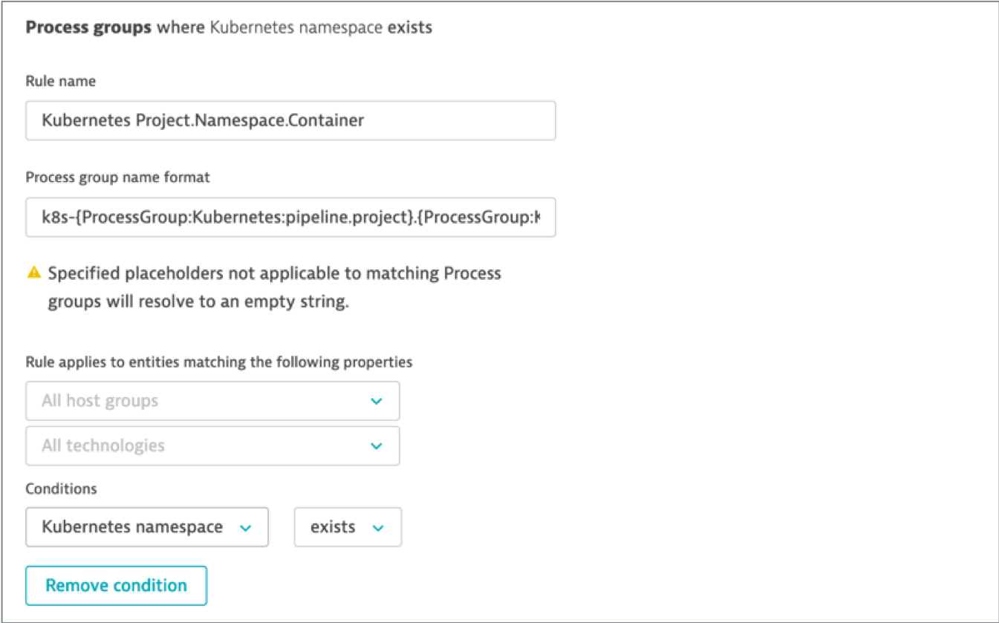

# Exercise #4 Customize Process Group naming rules for Kubernetes

## Explore auto-detected Process and Process Group names

Take a quick look at the current <b>Process</b> and <b>Process Group</b> naming as automatically assigned by Dynatrace with the built-in naming rules.

You can see processes and process groups in different locations in the Dynatrace console:

- Technologies dashboard : process groups by underlying technology
- Hosts dashboard : processes monitored on a host (Kubernetes node)
- Transactions & Services dashboard : for a given Service, the infographic shows the Process Group Instances implementing the Service
- Smartscape

## Configure custom Process Group naming rule

What we want to achieve is having process groups showing up with naming that tells us:

- Whether the process runs in Kubernetes or not. Let's have the Process Group name start with ”k8s" for those in Kubernetes.
- What project is the process (container) part of. Your company likely has multiple projects running in the same cluster.
- The process/container/pod namespace, which in our case with Sock Shop also tells us if it's production or dev.
- The container name, which correspond to our microservice name

Target Process Group naming convention :  <b>k8s-project-namespace-container</b>
  
Let's apply that configuration in Dynatrace!

- Go in <b>Settings -> Processes and containers -> Process group naming rules</b> and click <b>Add a new rule</b>
- Provide a name to the rule, for example : `Kubernetes Project.Namespace.Container`
- First, we want this rule to apply only to containerized processes running in Kubernetes. This is done by defining a condition.
  - In the conditions drop-down, select the property `"Kubernetes namespace"` and the condition `"exists"`
-For the name format, we can enter free text and/or use placeholders.
  - A list of available placeholder is displayed as a side note.
  - Placeholders are in between brackets {} to distinguish from free text
  - Enter this format : 
    - `k8s-{ProcessGroup:Kubernetes:pipeline.project}.{ProcessGroup:KubernetesNamespace}.{ProcessGroup:KubernetesContainerName}`
  - Don’t forget to save!

### Preview 

Before saving a rule that will affect the way information is displayed to Dynatrace users, you would probably like to have a glance of the potential result. 

This is possible!

- Click the <b>Preview</b> button

## Validate

Navigate to <b>Technologies</b>, <b>Hosts</b> and <b>Transactions & Services</b> views to look at the applied custom Process naming rule.

---

[Previous : #3 Automatic import of k8s labels and annotations](../03_Import_k8s_labels_annotations) :arrow_backward: :arrow_forward: [Next : #5 Customize Service naming rules for k8s](../05_Customize_Service_naming_rules)

:arrow_up_small: [Back to overview](../)