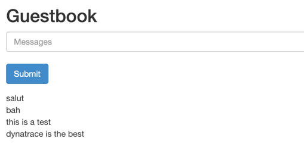
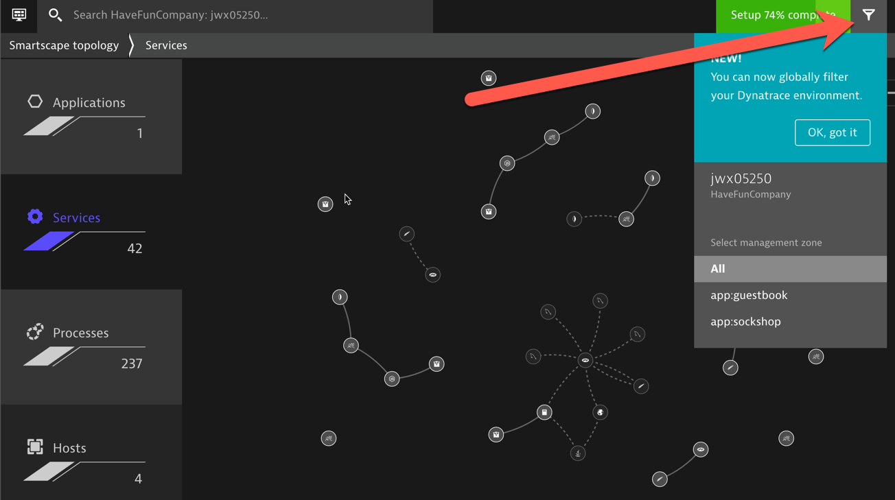

# Exercise #6 Create Management Zones by application

## Deploy a new application

<u>Scenario</u> : The company is developing many products. Aside from <i>Sock Shop</i>, a new project, named <i>guestbook</i>, is starting on Kubernetes.

Execute the following script to deploy guestbook :

```sh
$ ./deploy-guestbook-app.sh
```

Execute the following command to obtain the guestbook home page URL
```sh
$ kubectl get svc -n guestbook
```

Take a note of the External-IP for the `frontend` service and copy it in a new browser tab/window to load the guestbook app home page.



### Enter a comment

The app is still very basic :grinning: . 

It's a simple PHP frontend taking comments as input and writing those to a Redis data store. If you reload the app in a different browser, you will see the comments entered being displayed.

- Enter a few comments to generate transactions.


## View the guestbook app in Dynatrace

- Switch to the Dynatrace console, in the <b>Services</b> view , you will see 2 new services
- In the <b>Technologies</b> view, you will also see new technologies associated to the guestbook app processes (Apache HTTP Server, PHP and Redis)
- Select one of those 2 services and drill-down to the underlying process group. Expand the properties and take a look.


## Create Management Zones based on process property

We want to be able to easily segregate views of <b>Sock Shop</b> and <b>guestbook</b>. This is done by leveraging <b>Management Zones</b>. 

The `product` tag (based on the pod label) is a good candidate as a condition for the <b>Management Zone</b> rule.

- Go in <i>Settings -> Preferences -> Management Zones</i>. Click <b>Add Management Zones</b>.
- We will start with Sock Shop. Enter a name for the Management Zone : `app:sockshop`
- Click <b>Add new rule</b>


### Configure Management Zone rules

The rule will be based on Process groups <b>(1)</b>. 
- <u>Note</u>: It would also be valid to base it on Services.

The condition is based on a <b>Process Group</b> tag, `product` <b>(2)</b>, auto-imported from a Kubernetes label and of value equal to `sockshop` <b>(3)</b> 


### Preview Management Zone rule

- Click on <b>Preview</b>
  
Preview shows the <b>Management Zone</b> will only apply to <b>Process Groups</b> and <b>Processes</b>. This is normal, this is how we had it defined.


### Extending Management Zone rule

The Management Zone rule can be extended to underlying <b>Hosts</b> (nodes) and to <b>Services</b> associated to the <b>Process Groups</b>.

- To extend to <b>Hosts</b> and <b>Services</b>, tick the associated check boxes 


- Click on <b>Preview</b>

You now see the <b>Management Zone</b> will apply to services and infrastructure entities such as <b>Hosts</b> and <b>Process Groups</b>.


- <u>DON'T FORGET to click on the <b>Save</b> button!</u> 

### Repeat for the guestbook app

Repeat the same steps for the <b>guestbook</b> app. The only differences are: 

- Name the Management Zone : `app:guestbook`
- Use `[Kubernetes]product` equals `guestbook`
- <u>DON'T FORGET to save!</u> 


## Validate in Dynatrace

- Navigate in the different dashboards
- You will see a filter icon appear in the top menu bar
- Clicking on this button will list the available <b>Management Zones</b> 



---

[Previous : #5 Customize Service naming rules for Kubernetes](../05_Customize_Service_naming_rules) :arrow_backward: :arrow_forward: [Next : #7 Create Management Zones by namespace](../07_Management_Zones_by_namespace)

:arrow_up_small: [Back to overview](../)